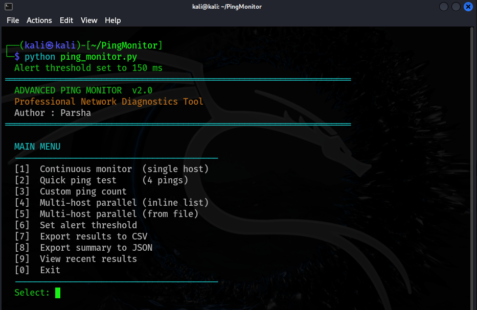
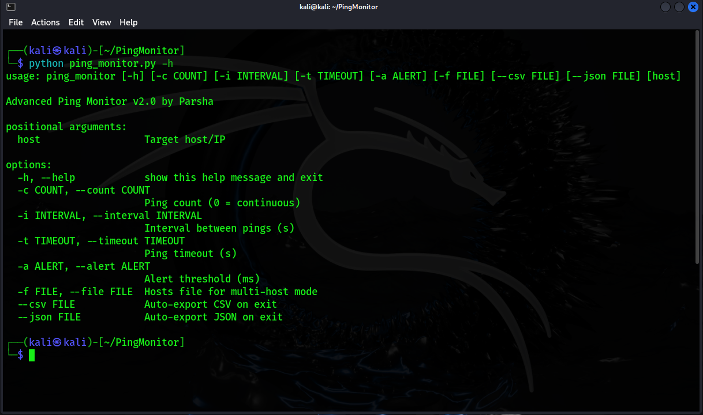
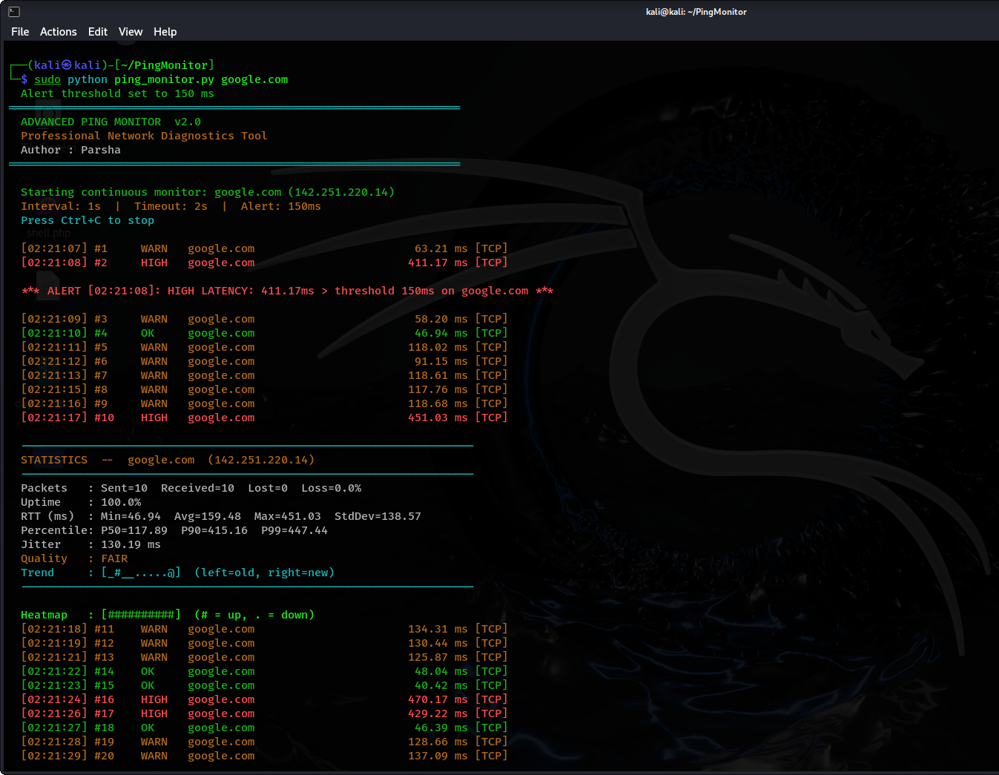
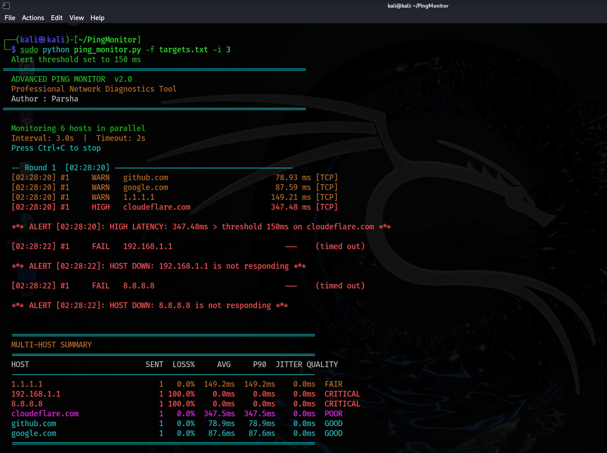

# Advanced Ping Monitor

**Professional network diagnostics tool**  

---

## Features

- Real time continuous monitoring with live RTT display
- Parallel multi host monitoring using threads
- Jitter, standard deviation, and percentile stats (P50 / P90 / P99)
- Host down detection and auto recovery alerts with cooldown
- Structured JSON session logs and CSV export
- TCP fallback when ICMP is unavailable (no root required)
- Full CLI argument support scriptable and automation friendly

---

## Requirements

```
Python 3.8+
pythonping
colorama
```

Install dependencies:

```bash
pip install pythonping colorama
```

> On Linux/macOS, ICMP ping requires root. Run with `sudo` or the tool will automatically fall back to TCP latency.

---

## Usage

### Interactive menu

```bash
python ping_monitor.py
```


### Command-line (non-interactive)

```bash
# Continuous monitor
python ping_monitor.py google.com

# Fixed ping count
python ping_monitor.py 8.8.8.8 -c 10

# Custom interval and alert threshold
python ping_monitor.py google.com -i 2 -a 200

# Multi-host from file
python ping_monitor.py -f targets.txt -i 5

# Auto-export on exit
python ping_monitor.py google.com --csv report.csv --json summary.json
```

### CLI Options

| Flag | Description | Default |
|------|-------------|---------|
| `host` | Target host or IP | — |
| `-c`, `--count` | Ping count (0 = continuous) | `0` |
| `-i`, `--interval` | Seconds between pings | `1` |
| `-t`, `--timeout` | Ping timeout in seconds | `2` |
| `-a`, `--alert` | High-latency alert threshold (ms) | `150` |
| `-f`, `--file` | Hosts file for multi-host mode | — |
| `--csv` | Auto-export results to CSV on exit | — |
| `--json` | Auto-export summary to JSON on exit | — |



---
## Output

**Continuous monitor live RTT, alerts, statistics and heatmap:**


## Hosts File Format

Plain text, one host per line. Lines starting with `#` are ignored.

```
# targets.txt
google.com
8.8.8.8
cloudflare.com
192.168.1.1
```
Multi host parallel mode summary table with per host quality rating:


---

**Statistics block (every 10 pings):**
```
  Packets   : Sent=10  Received=9  Lost=1  Loss=10.0%
  Uptime    : 90.0%
  RTT (ms)  : Min=17.1  Avg=22.4  Max=134.2  StdDev=8.3
  Percentile: P50=19.2  P90=88.1  P99=131.0
  Jitter    : 4.6 ms
  Quality   : FAIR
  Trend     : [____,,--==++**##@@@@**==--,,____,,--==]
  Heatmap   : [##########.#########]
```

**Quality levels:** `EXCELLENT` / `GOOD` / `FAIR` / `POOR` / `CRITICAL`

---

## Exported Files

| File | Contents |
|------|----------|
| `ping_log.json` | Full session history (auto-saved on exit) |
| `ping_report.csv` | Raw per-ping results |
| `ping_summary.json` | Per-host aggregated stats |

---
## Author
Prasad
## License
MIT License - free to use, modify, and distribute.
